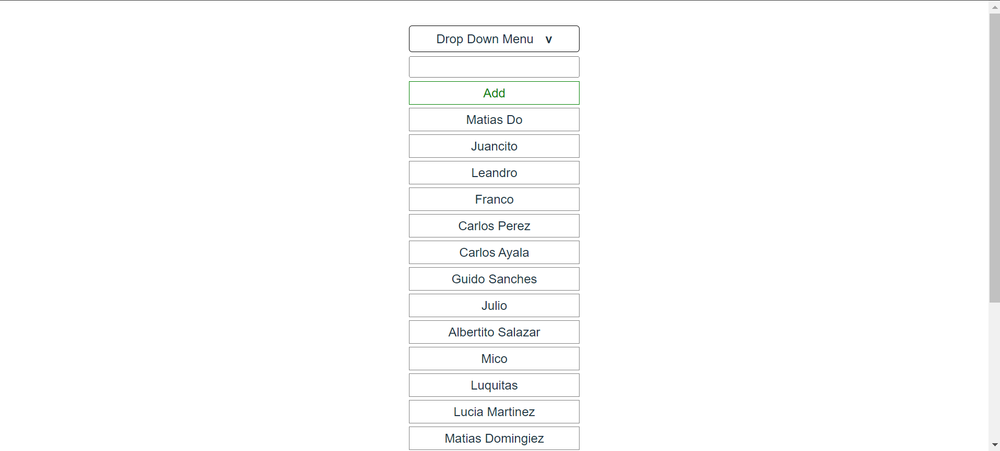
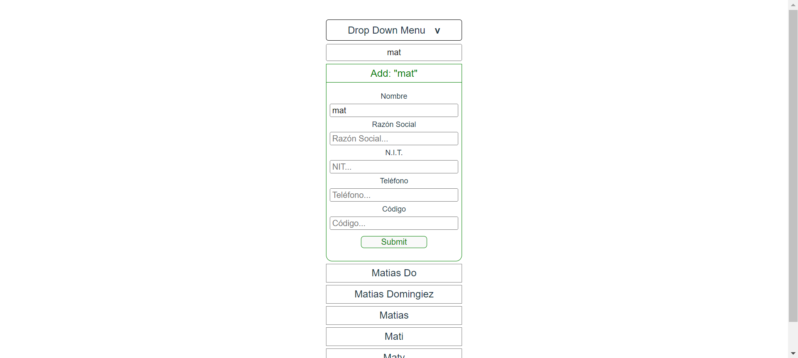
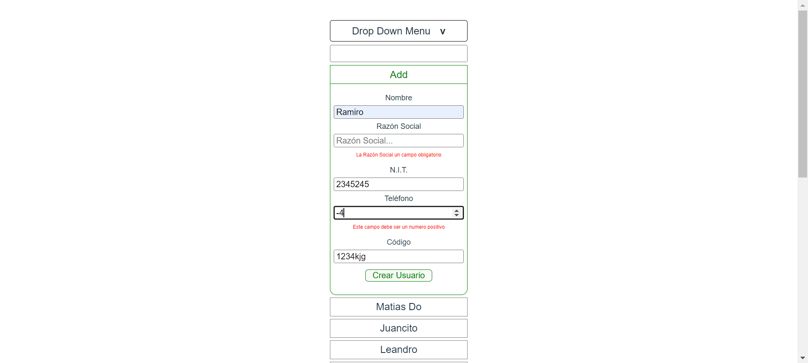
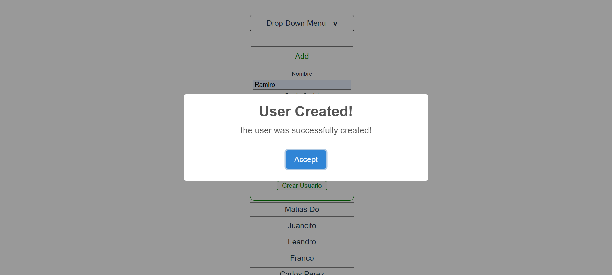

# TuGerenteChallenge
A challenge made for the TuGerente Team.

## Desarrollar usando reactjs un componente de tipo dropdown (o combobox)

- CHECK- Al desplegarlo consultará a un servicio de firebase 
  buscando coincidencias según el texto escrito 
  (o sin filtro, en caso de que no se haya escrito texto).

- CHECK- El modelo en firebase consistirá de los siguientes atributos:
  1. nombre
  2. razón social
  3. nit
  4. teléfono
  5. código

- CHECK - Debe solicitar resultados paginados de 20 en 20, 
  y solo deberá traer la siguiente página cuando se esté 
  scrolleando cerca al final de la lista actual de resultados.

- CHECK - Debe permitir parametrizar por qué atributo del objeto se buscará.
 La parametrización se debe hacer por código, no en tiempo de ejecución

- CHECK- El primer resultado del dropdown debe ser una opción fija que al 
  darle click levante un pequeño pop-up, parte del componente, 
  que permita agregar un nuevo objeto con el texto ya ingresado, 
  pero permitiendo editarlo antes de guardar también.

- CHECK- El proyecto debe correrse en un contenedor de docker
- CHECK- Adjuntar también dentro del repositorio, capturas de pantalla de la solución funcionando

# Funcionalidades 

- Component first View
#

- Component on Click
#

- Component on Search
#

- Component on Creation Form
#

- Component on Form validated errors
#

- Component on Creation Success
#

